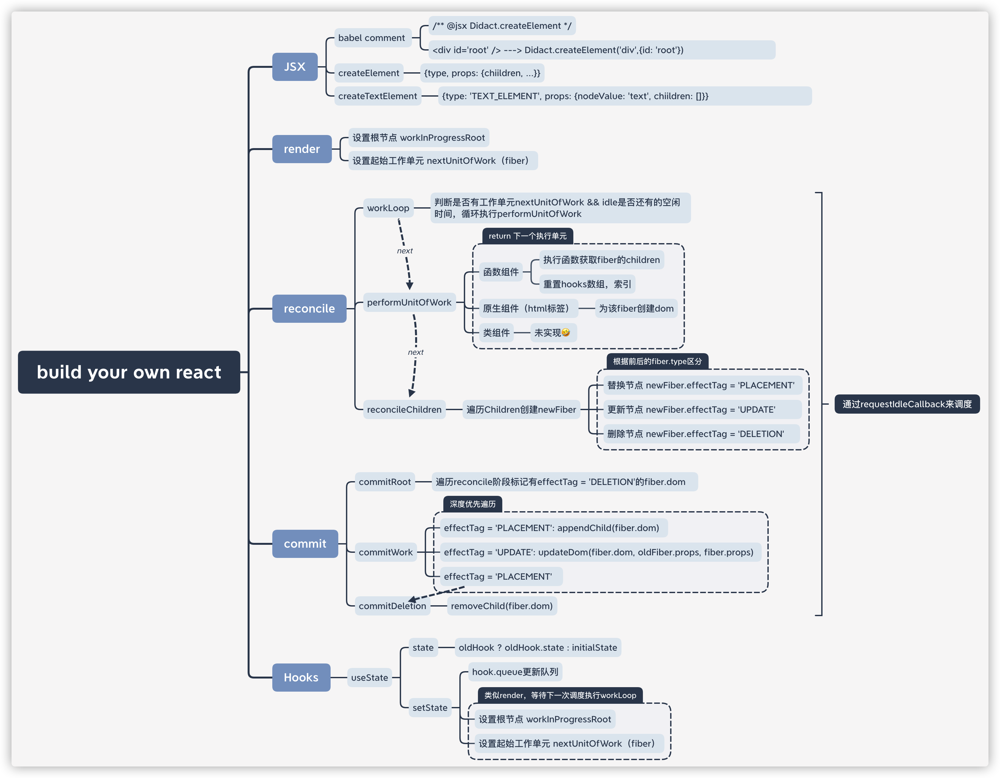

# 实现你的毛坯版React

## [阅读该篇文章，即刻拥有](https://pomb.us/build-your-own-react/)

### 实现

- [x] JSX

- [x] function component

- [ ] Class component

- [x] hooks only useState

- [x] render

- [x] reconcile

- [x] commit

- [x] Fiber

- [x] Concurrent Mode

### 未实现

> 太多了，就不一一列举了 : (

### 内容概括



### 来，感受一下毛坯房  : )

```shell
# 安装依赖 
yarn

# 跑开发环境
yarn start

# 尽情玩耍
localhost:3000
```

